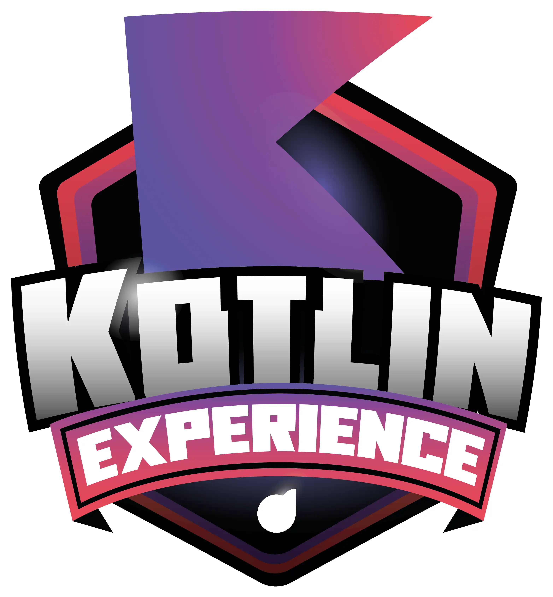

  

  

  # Bootcamp Kotlin Experience - [DIO](https://www.dio.me/en)

  

  ### Módulo 1 - Princípios de Agilidade e Desenvolvimento de Software

  - Conheça as Oportunidades da DIO

  - Seja Protagonista Neste Bootcamp
  
  - Mentoria (Live) | Kotlin Experience | Aula Inaugural 

  - Introdução ao Desenvolvimento Moderno de Software

  - Como Entregar seu Desafio de Projeto
 
  - Criando seu Primeiro Repositório no GitHub Para Compartilhar Seu Progresso

   

  ### Módulo 2 - Dominando a Linguagem de Programação Kotlin

  - Conhecendo o Kotlin e Sua Documentação Oficial

  - Introdução Prática à Linguagem de Programação Kotlin
  
  - Estruturas de Controle de Fluxo e Coleções em Kotlin

  - Orientação a Objetos e Tipos de Classes na Prática com Kotlin

  - O Poder das Funções em Kotlin
 
  - Abstraindo Formações da DIO Usando Orientação a Objetos com Kotlin

   

  ### Módulo 3 - Refinando Sua Técnica Com Desafios de Código em Kotlin

  - Suas Primeiras Condições em Kotlin

  - Avançando Tecnicamente Com a Expressão When
  
  - Explorando Mapas, Loops e Regras com Kotlin

  - Utilizando a Keyword Object com Orientação a Objetos (OO)

  - Orientação a Objetos (OO) Visando Soluções Mais Idiomáticas

     

  ### Módulo 4 - Fortalecendo Seu Perfil Profissional

  - Deixando Seu LinkedIn Atrativo

  - Turbine Seu Currículo na DIO
  
  - Transformando seu Conhecimento em Artigos Técnicos

  - Se Preparando Para Uma Entrevista

   

  

  ### _#BootcampKotlinExperience_
  ### _#ContratoDeCompromisso_

  

